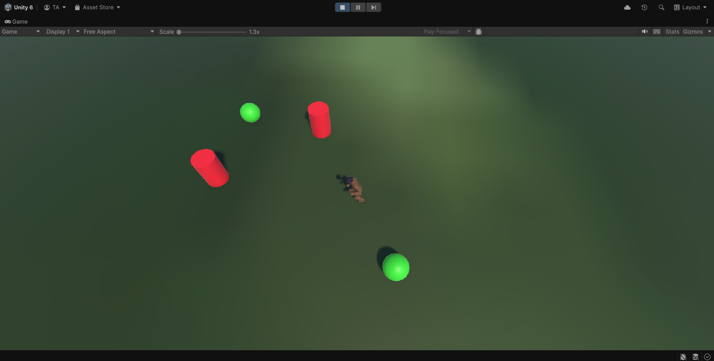
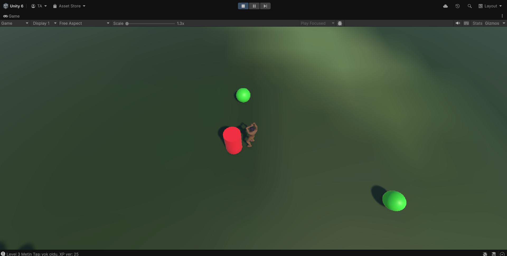
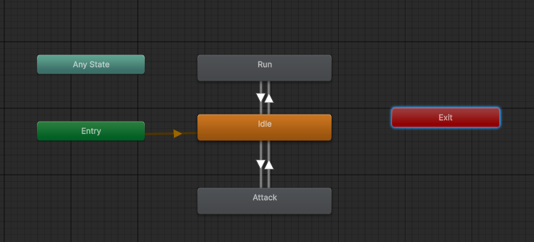

# Warrior Metin Game (Unity - C#)

A third-person hack-and-slash style warrior game made with Unity.  
Explore an open battlefield, destroy different levels of *Metin Taşı* (metin stones), and gain experience points (XP) as a warrior.

---

> Character navigating between metin stones

---

## Built With

- **Unity Engine** (3D)
- **C# scripting**
- **NavMeshAgent** (click-to-move player)
- **Animator** (run and attack animations)
- Modular enemy architecture via inheritance

---

## Gameplay Overview

- Right-click to move your character.
- Right-click on a Metin Taşı to start attacking.
- Warrior automatically navigates and engages in combat when in range.
- Each Metin Taşı has a unique health pool and XP reward.
- On destruction, XP is added to the player's stats.
- Camera follows the player smoothly from above.

---

## Screenshots

### Movement System  

### Combat System  

### Animator Setup  

---

## Metin Taşı Types

| Type         | Health | XP Reward |
|--------------|--------|-----------|
| MetinTasi1   | 100    | 15        |
| MetinTasi2   | 200    | 20        |
| MetinTasi3   | 300    | 25        |

Each one spawns randomly in the world and gives different XP amounts upon destruction.

---

## Script Overview

### Player Scripts

| Script             | Description |
|--------------------|-------------|
| `PlayerMovement.cs` | Click-to-move using `NavMeshAgent` |
| `PlayerCombat.cs`   | Handles target selection, attack cooldown, and animation triggers |
| `PlayerStats.cs`    | Stores and updates current XP |
| `FollowCamera.cs`   | Smoothly follows player with offset and LookAt |

### Enemy Scripts

| Script              | Description |
|---------------------|-------------|
| `MetinTasiBase.cs`  | Base class with health, damage, and XP logic |
| `MetinTasi1/2/3.cs` | Subclasses with varying health and XP |
| `MetinTasiSpawner.cs` | Spawns random metin stones across a defined range |

---

## Mechanics

- **Right-click movement** to world position or enemy
- **Attack range check** and auto-stop for melee
- **XP reward system** integrated with `PlayerStats`
- **Animation states** handled via Unity Animator Controller:
  - `Idle`
  - `Run`
  - `Attack`

---

## Controls

| Action            | Input                      |
|-------------------|----------------------------|
| Move              | Right-click on ground      |
| Attack            | Right-click on Metin Taşı  |

---

## How to Play

1. Clone or download this project.
2. Open it in **Unity 2021.3 or newer**.
3. Ensure you bake the **NavMesh** for the terrain.
4. Press Play and start slicing through metin stones!

---

